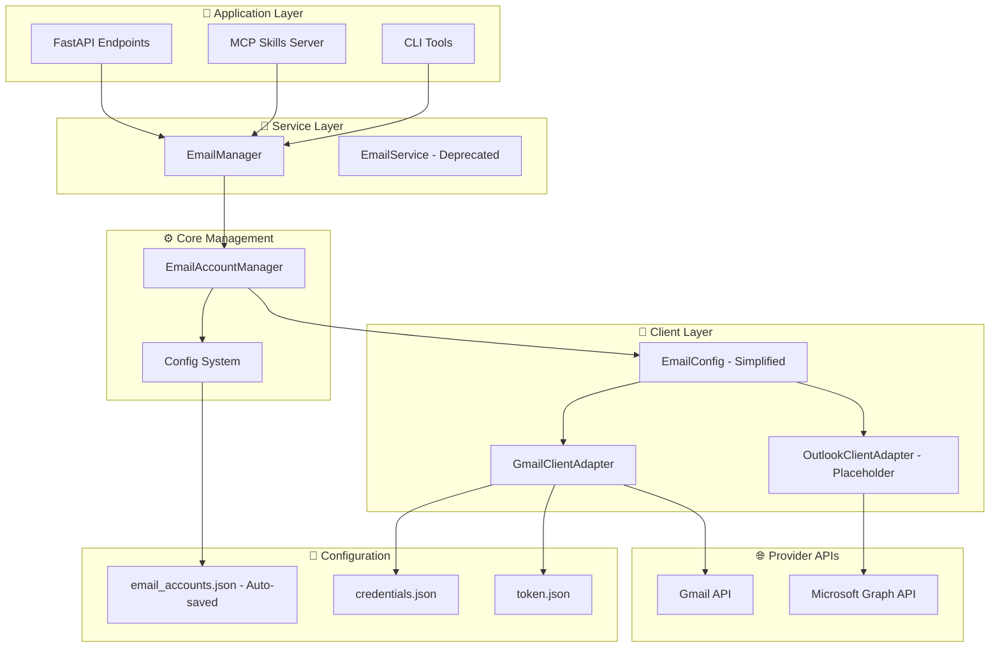
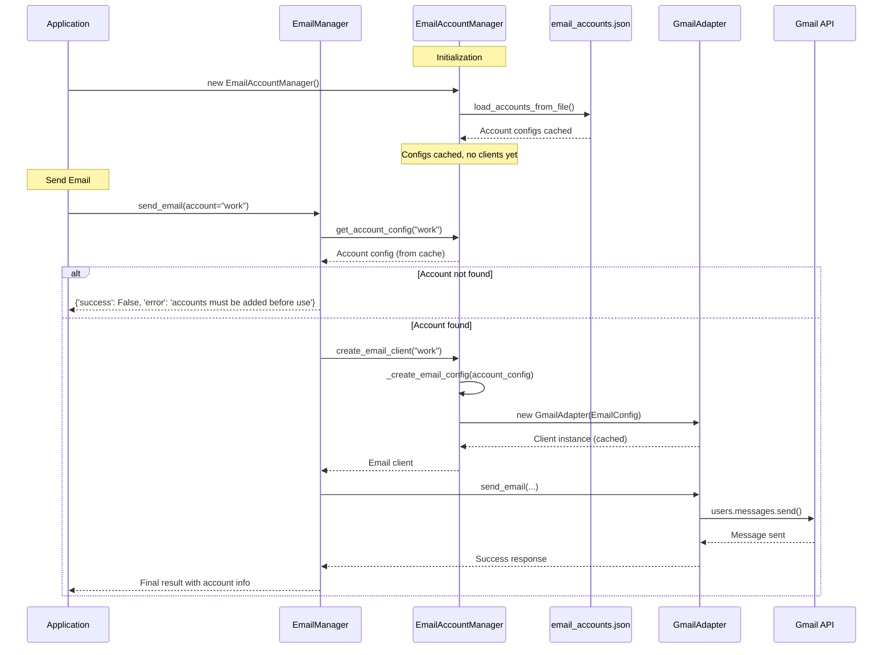
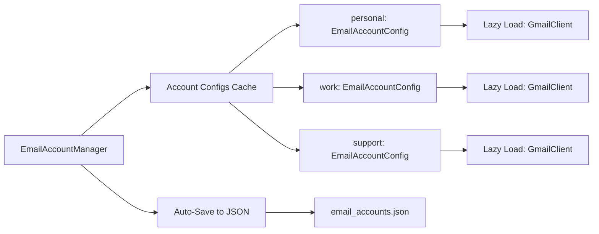
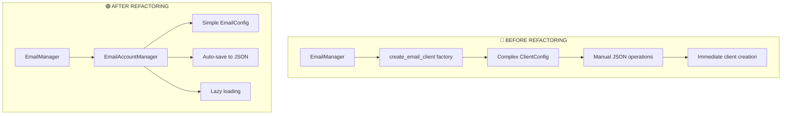

# Email Service Architecture Documentation

## Overview

The **Its-Friday** project features a sophisticated multi-account email system built on a refactored architecture that supports multiple email providers (currently Gmail, with Outlook as a placeholder). The system provides a unified interface for managing emails across different accounts while maintaining provider-specific optimizations.

## 🏗️ Architecture Overview



## 🎯 Recent Refactoring - Three Key Solutions

### Solution 1: Auto-persistence to JSON file
**Problem**: Account changes in EmailAccountManager were not automatically saved to email_accounts.json  
**Solution**: All account operations (add, delete, update) now automatically persist to JSON file

```python
# Before: Manual saving required
accounts = EmailAccountManager.create_account(accounts, new_account)
EmailAccountManager.save_accounts_to_file(accounts, file_path)

# After: Auto-save on every operation
manager.add_account(new_account)  # Automatically saves to JSON
manager.update_account("work", {"enabled": False})  # Auto-saves
manager.delete_account("old_account")  # Auto-saves
```

### Solution 2: Lazy loading with cached account info
**Problem**: EmailAccountManager needed to separate account config caching from client instantiation  
**Solution**: Account configs cached on init, clients created only when needed (lazy loading)

```python
# On initialization - only configs are loaded
manager = EmailAccountManager()
print(f"Cached configs: {len(manager._account_configs)}")  # > 0
print(f"Cached clients: {len(manager._email_clients)}")    # = 0

# On first use - client is created and cached
client = manager.create_email_client("personal")  # Creates client
client2 = manager.create_email_client("personal")  # Returns cached client
```

### Solution 3: Single simplified email config
**Problem**: ClientConfig was complex and used both Config and EmailAccountConfig  
**Solution**: Replaced with single EmailConfig class containing only email-related settings

```python
# Before: Complex ClientConfig with mixed settings
class ClientConfig:
    def __init__(self, base_config, account_config):
        # Copy weather_api_key, temp_unit, etc. (unrelated to email)
        # Complex attribute copying logic

# After: Simple EmailConfig with only email settings
class EmailConfig:
    def __init__(self, account_config, base_config=None):
        self.account_name = account_config.name
        self.provider = account_config.provider
        self.google_credentials_path = account_config.google_credentials_path
        # Only email-related settings
```

## 🎯 Core Components

### 1. EmailAccountManager (Refactored Core Engine)
**Location**: `app/utils.py`

Now centralized manager for email client creation, caching, and lifecycle management with the three solutions implemented:

**Key Features**:
- ✅ **Auto-persistence**: All account changes automatically saved to JSON
- ✅ **Lazy loading**: Configs cached on init, clients created on demand
- ✅ **Simplified config**: Uses EmailConfig instead of complex ClientConfig
- ✅ **Email client creation and caching**
- ✅ **Provider registration and management**
- ✅ **Account-specific configuration**

```python
# Initialize manager (loads and caches account configs)
manager = EmailAccountManager(config)

# Add account with auto-save
new_account = EmailAccountConfig(name="work", provider="gmail", ...)
success = manager.add_account(new_account)  # Auto-saves to JSON

# Lazy loading - client created only when needed
client = manager.create_email_client("work")  # Creates and caches
client2 = manager.create_email_client("work")  # Returns cached instance

# Account management with auto-save
manager.update_account("work", {"enabled": False})  # Auto-saves
manager.delete_account("old_account")  # Auto-saves
```

### 2. EmailManager (Updated Service Layer)
**Location**: `app/services/email_manager.py`

Updated to handle missing accounts properly and provide better error messages:

**New Error Handling**:
```python
# If account not found in configuration
result = await email_manager.send_email(
    to="test@example.com",
    subject="Test",
    body="Hello",
    account="nonexistent_account"
)
# Returns: {'success': False, 'error': 'accounts must be added before use'}
```

### 3. EmailConfig (New Simplified Configuration)
**Location**: `app/utils.py`

Replaces the complex ClientConfig with a simple, email-focused configuration:

```python
class EmailConfig:
    """Simplified configuration class for email clients."""
    
    def __init__(self, account_config: EmailAccountConfig, base_config=None):
        # Account-specific information
        self.account_name = account_config.name
        self.provider = account_config.provider
        
        # Provider-specific settings
        self.google_credentials_path = account_config.google_credentials_path
        self.google_token_path = account_config.google_token_path
        
        # Basic settings from base config (timeout, security_key, etc.)
        if base_config:
            self.timeout = getattr(base_config, 'timeout', 10)
```

### 4. Config (Updated for New Architecture)
**Location**: `app/config.py`

Modified to work with the new EmailAccountManager approach:

```python
class Config(BaseSettings):
    # Email Accounts Configuration (DEPRECATED - Now managed by EmailAccountManager)
    email_accounts: Dict[str, EmailAccountConfig] = Field(
        default_factory=dict,
        description="DEPRECATED: Email accounts are now managed by EmailAccountManager"
    )
    
    # Deprecated methods that delegate to EmailAccountManager
    def get_email_account_config(self, account_name: str):
        """DEPRECATED: Use EmailAccountManager.get_account_config() instead."""
        manager = EmailAccountManager(self)
        return manager.get_account_config(account_name)
```

## 🔄 Data Flow with New Architecture



## 📋 Configuration System

### Auto-Saving Email Accounts
**Location**: `app/email_accounts.json`

All account operations automatically persist to this file:

```json
{
  "personal": {
    "name": "personal",
    "provider": "gmail",
    "display_name": "Personal Gmail Account",
    "google_credentials_path": "secrets/credentials.json",
    "google_token_path": "secrets/token.json",
    "enabled": true,
    "default_account": true
  },
  "work": {
    "name": "work",
    "provider": "gmail",
    "display_name": "Work Gmail Account",
    "google_credentials_path": "secrets/work_credentials.json",
    "google_token_path": "secrets/work_token.json",
    "enabled": true,
    "default_account": false
  }
}
```

### Adding a New Account

**Option 1: Programmatically**
```python
from app.config import EmailAccountConfig
from app.utils import EmailAccountManager

# Create account configuration
new_account = EmailAccountConfig(
    name="work_backup",
    provider="gmail",
    display_name="Work Backup Gmail",
    google_credentials_path=Path("secrets/work_backup_credentials.json"),
    google_token_path=Path("secrets/work_backup_token.json"),
    enabled=True,
    default_account=False
)

# Add account (automatically saves to JSON)
manager = EmailAccountManager()
success = manager.add_account(new_account)
print(f"Account added: {success}")
```

**Option 2: Manually Edit JSON**
1. Add the new account to `app/email_accounts.json`
2. Ensure credentials files exist in the specified paths
3. Restart the application or reload the EmailAccountManager

**Option 3: Using Email Manager**
```python
# Through the main email manager
email_manager = EmailManager(config)

# The account will be available immediately after adding to JSON
result = await email_manager.send_email(
    to="test@example.com",
    subject="Test from new account",
    body="Hello World!",
    account="work_backup"  # Uses the newly added account
)
```

## 🚀 Key Features

### Multi-Account Support with Auto-Save



### Error Handling for Missing Accounts

```python
# EmailManager now properly handles missing accounts
result = await email_manager.send_email(
    to="test@example.com",
    subject="Test",
    body="Hello",
    account="nonexistent"
)

# Returns standardized error:
{
    'success': False,
    'error': 'accounts must be added before use',
    'account': 'nonexistent',
    'manager': 'EmailManager'
}
```

### Simplified Client Configuration

```python
# Old approach: Complex ClientConfig
client_config = ClientConfig(base_config, account_config)
# Contains weather_api_key, temp_unit, etc. (irrelevant to email)

# New approach: Simple EmailConfig
email_config = EmailConfig(account_config, base_config)
# Contains only: account_name, provider, credentials_path, timeout, etc.
```

## 🔧 Usage Examples

### Basic Usage with Account Management

```python
from app.services.email_manager import EmailManager
from app.config import Config, EmailAccountConfig
from app.utils import EmailAccountManager

# Initialize
config = Config()
email_manager = EmailManager(config)

# Send from specific account
result = await email_manager.send_email(
    to="colleague@company.com",
    subject="Work Update",
    body="Project status...",
    account="work"
)

# Handle missing account
result = await email_manager.send_email(
    to="test@example.com",
    subject="Test",
    body="Hello",
    account="nonexistent"
)
print(result)  # {'success': False, 'error': 'accounts must be added before use'}
```

### Account Management Operations

```python
# Get account manager
account_manager = EmailAccountManager(config)

# List available accounts
accounts = account_manager.list_account_names()
print(f"Available accounts: {accounts}")

# Add new account with auto-save
new_account = EmailAccountConfig(
    name="customer_service",
    provider="gmail",
    display_name="Customer Service Gmail",
    google_credentials_path=Path("secrets/cs_credentials.json"),
    google_token_path=Path("secrets/cs_token.json"),
    enabled=True,
    default_account=False
)

success = account_manager.add_account(new_account)  # Auto-saves to JSON
print(f"Account added and saved: {success}")

# Update account with auto-save
success = account_manager.update_account("customer_service", {
    "display_name": "Customer Support Gmail",
    "enabled": False
})
print(f"Account updated and saved: {success}")

# Delete account with auto-save
success = account_manager.delete_account("customer_service")
print(f"Account deleted and saved: {success}")
```

### Lazy Loading Demonstration

```python
# Initialize manager - only configs loaded, no clients created
manager = EmailAccountManager(config)
print(f"Configs loaded: {len(manager._account_configs)}")  # Shows available accounts
print(f"Clients created: {len(manager._email_clients)}")   # Should be 0

# First use - client created and cached
client1 = manager.create_email_client("personal")
print(f"Clients created: {len(manager._email_clients)}")   # Should be 1

# Second use - cached client returned
client2 = manager.create_email_client("personal") 
print(f"Same client instance: {client1 is client2}")       # Should be True

# Different account - new client created
client3 = manager.create_email_client("work")
print(f"Clients created: {len(manager._email_clients)}")   # Should be 2
```

## 🔌 MCP Integration

The system integrates with the Model Context Protocol (MCP) server for AI assistant interactions:

**Location**: `skills/server.py`

```python
@mcp.tool()
async def send_email_from_account(
    to: str,
    subject: str,
    body: str,
    account: Optional[str] = None
) -> Dict[str, Any]:
    """Send email from specific account via EmailManager."""
    return await email_manager.send_email(
        to=to, subject=subject, body=body, account=account
    )

@mcp.tool()
async def get_unread_emails_all_accounts() -> Dict[str, Any]:
    """Get unread emails from all configured accounts."""
    return email_manager.get_all_unread_messages()

@mcp.tool()
async def add_email_account(
    name: str,
    provider: str,
    display_name: str,
    credentials_path: str,
    token_path: str
) -> Dict[str, Any]:
    """Add a new email account with auto-save."""
    # Implementation uses EmailAccountManager.add_account()
```

## 🔄 Migration & Refactoring Summary

### What Changed



### Key Improvements

1. **✅ Auto-persistence**: Account changes automatically saved to JSON
2. **✅ Lazy loading**: Configs cached on init, clients created on demand  
3. **✅ Simplified config**: EmailConfig replaces complex ClientConfig
4. **✅ Better error handling**: Proper handling of missing accounts
5. **✅ Centralized management**: All client operations in EmailAccountManager
6. **✅ Account isolation**: Each client has its own configuration

### Before vs After Comparison

| Aspect | Before | After |
|--------|--------|-------|
| **Account persistence** | Manual save required | Auto-save on every operation |
| **Client creation** | Immediate on manager init | Lazy loading on first use |
| **Configuration** | Complex ClientConfig with mixed settings | Simple EmailConfig with email-only settings |
| **Error handling** | Generic exceptions | Specific error messages for missing accounts |
| **Account management** | Scattered across multiple files | Centralized in EmailAccountManager |
| **JSON operations** | Manual load/save calls | Automatic background persistence |

## 🔮 Future Enhancements

### Planned Features

1. **Real Outlook Integration**: Microsoft Graph API implementation
2. **IMAP/SMTP Support**: Generic email protocol support  
3. **Account Templates**: Pre-configured account templates for common providers
4. **Bulk Operations**: Efficient operations across multiple accounts
5. **Account Validation**: Enhanced validation with provider-specific checks
6. **Configuration UI**: Web interface for account management
7. **Real-time Sync**: Live synchronization of account changes

## 🛠️ Development Guide

### Adding a New Provider

1. **Implement BaseEmailClient**:
```python
class NewProviderAdapter(BaseEmailClient):
    def __init__(self, config=None, **kwargs):
        super().__init__()
        # config is now EmailConfig (simplified)
        self.account_name = config.account_name
        self.provider_settings = config.provider_specific_settings
```

2. **Register Provider**:
```python
account_manager.register_provider('new_provider', NewProviderAdapter)
```

3. **Add Account with Auto-save**:
```python
new_account = EmailAccountConfig(
    name="test_account",
    provider="new_provider",
    # provider-specific settings
)
account_manager.add_account(new_account)  # Auto-saves
```

### Testing the New Architecture

```python
def test_auto_persistence():
    """Test that account operations auto-save"""
    manager = EmailAccountManager()
    
    # Add account
    account = EmailAccountConfig(name="test", provider="gmail")
    success = manager.add_account(account)
    assert success
    
    # Verify persistence
    new_manager = EmailAccountManager()  # Fresh instance
    assert "test" in new_manager._account_configs

def test_lazy_loading():
    """Test that clients are created only when needed"""
    manager = EmailAccountManager()
    
    # No clients initially
    assert len(manager._email_clients) == 0
    
    # Create client on demand
    if manager._account_configs:
        account_name = list(manager._account_configs.keys())[0]
        client = manager.create_email_client(account_name)
        assert len(manager._email_clients) == 1

def test_simplified_config():
    """Test EmailConfig simplicity"""
    account_config = EmailAccountConfig(name="test", provider="gmail")
    email_config = EmailConfig(account_config)
    
    # Should have email settings
    assert hasattr(email_config, 'account_name')
    assert hasattr(email_config, 'provider')
    
    # Should not have unrelated settings
    assert not hasattr(email_config, 'weather_api_key')
```

## 📊 System Status

### Current Implementation
- ✅ **Auto-persistence**: All account operations auto-save to JSON
- ✅ **Lazy loading**: Configs cached on init, clients on demand
- ✅ **Simplified config**: EmailConfig replaces ClientConfig
- ✅ **EmailAccountManager**: Centralized client management  
- ✅ **EmailManager**: Updated with proper error handling
- ✅ **Gmail Integration**: Complete Gmail API support
- ✅ **Configuration System**: JSON-based auto-saving account config
- ✅ **MCP Integration**: Skills server with email tools
- ⚠️ **Outlook Support**: Placeholder implementation
- ⚠️ **IMAP/SMTP**: Not yet implemented

### Architecture Health
- ✅ **Auto-persistence**: Eliminates manual save operations
- ✅ **Lazy loading**: Improves performance and resource usage
- ✅ **Simplified config**: Reduces complexity and improves maintainability
- ✅ **Error handling**: Clear messages for missing accounts
- ✅ **Separation of concerns**: Clear layer boundaries
- ✅ **Testability**: Easily mockable components
- ✅ **Extensibility**: Simple to add new providers
- ✅ **Documentation**: Comprehensive API documentation

## 🎯 Summary

The Its-Friday email system has been successfully refactored with three key solutions:

**🎯 The Three Solutions Implemented:**

1. **Auto-persistence**: Account changes automatically save to `email_accounts.json`
2. **Lazy loading**: Account configs cached on init, clients created only when needed  
3. **Simplified config**: EmailConfig replaces complex ClientConfig with email-only settings

**🏗️ Key Architectural Benefits:**

- 🏗️ **Cleaner Architecture**: Clear separation between config management and client operations
- 🔄 **Better Performance**: Lazy loading reduces memory usage and startup time
- 🛡️ **Robust Error Handling**: Proper handling of missing accounts with clear error messages
- 🔌 **Extensible Design**: Easy to add new email providers
- 📁 **Persistent Storage**: All account changes automatically saved
- 🛠️ **Developer Friendly**: Simplified configuration and clear APIs

**🚀 Usage for Separate Accounts:**

To use a separate email account, simply add it to the configuration and use it immediately:

```python
# Add account (auto-saves)
manager.add_account(new_account_config)

# Use immediately
result = await email_manager.send_email(
    to="recipient@example.com",
    subject="Hello from new account",
    body="Message content",
    account="new_account_name"  # Uses the newly added account
)
```

This architecture provides a solid foundation for multi-account email management while maintaining simplicity and extensibility for future enhancements.
