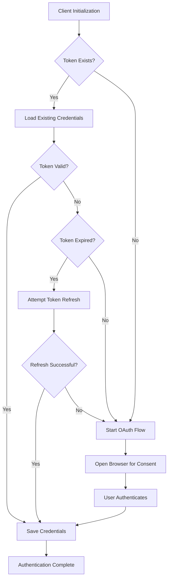

# OAuth 2.0 Authentication Flow Guide

This document illustrates how the Google API authentication works in the Its-Friday application, specifically focusing on the OAuth 2.0 flow implemented in the `GoogleBaseClient` class.

## Overview

The authentication system is designed with the following key features:

- **Automatic token management**: Handles token validation, refresh, and re-authentication
- **Multi-service support**: Works with Gmail, Calendar, and Drive clients
- **Scope management**: Validates and handles required permission scopes
- **Graceful error handling**: Manages authentication failures and token issues

## Authentication Flow Diagram



## Detailed Process

### 1. Client Initialization

The process begins when a client class (like `GmailClient`, `CalendarClient`, or `DriveClient`) is instantiated:

```python
def __init__(self):
    scopes = [
        "https://www.googleapis.com/auth/gmail.readonly",
        "https://www.googleapis.com/auth/gmail.send",
        # ... other scopes
    ]
    super().__init__(scopes, service_name="Gmail")
    self.service = build("gmail", "v1", credentials=self.creds)
```

Each client:
- Defines the required permission scopes
- Calls the parent `GoogleBaseClient` initialization
- Builds the appropriate service using the authenticated credentials

### 2. Authentication Process in `GoogleBaseClient`

The `_authenticate()` method in `GoogleBaseClient` manages the full authentication flow:

```python
def _authenticate(self):
    """
    Authenticate with Google APIs using OAuth 2.0 flow.
    Handles token validation, refresh, and re-authentication as needed.
    """
    self.logger.debug("Starting authentication process...")
    
    # Step 1: Try to load existing credentials
    if os.path.exists(self.token_path):
        try:
            self._load_existing_credentials()
        except Exception as e:
            self.logger.warning(f"Failed to load existing credentials: {e}")
            self._cleanup_invalid_token()

    # Step 2: Validate and refresh credentials if needed
    if not self.creds or not self.creds.valid:
        if self.creds and self.creds.expired and self.creds.refresh_token:
            self._attempt_token_refresh()
        
        # Step 3: Start OAuth flow if we still don't have valid credentials
        if not self.creds or not self.creds.valid:
            self._start_oauth_flow()

    # Step 4: Save valid credentials
    self._save_credentials()
    self.logger.info(f"{self.service_name} authentication successful")
```

### 3. Loading Existing Credentials

When a token file exists, the system attempts to load and validate it:

```python
def _load_existing_credentials(self):
    """Load and validate existing credentials from token file."""
    self.logger.debug("Loading existing credentials...")
    
    with open(self.token_path, 'r') as f:
        token_data = json.load(f)
        existing_scopes = token_data.get('scopes', [])
        
    # Check if scopes match
    if set(existing_scopes) != set(self.scopes):
        self.logger.info(
            f"Scope mismatch detected. "
            f"Existing: {existing_scopes}, Required: {self.scopes}"
        )
        raise ValueError("Scope mismatch - re-authentication required")
        
    # Load credentials with current scopes
    self.creds = Credentials.from_authorized_user_file(self.token_path, self.scopes)
    self.logger.debug("Existing credentials loaded successfully")
```

This method ensures that:
- The token file can be read and parsed
- The stored scopes match the currently required scopes
- Credentials are properly loaded from the file

### 4. Refreshing Expired Tokens

When a token is expired but contains a refresh token, the system attempts to refresh it:

```python
def _attempt_token_refresh(self):
    """Attempt to refresh expired credentials."""
    try:
        self.logger.debug("Attempting to refresh expired credentials...")
        self.creds.refresh(Request())
        self.logger.info("Credentials refreshed successfully")
    except RefreshError as e:
        self.logger.warning(f"Failed to refresh credentials: {e}")
        self.creds = None
```

### 5. OAuth 2.0 Authorization Flow

If no valid credentials exist or refresh fails, the system starts the OAuth flow:

```python
def _start_oauth_flow(self):
    """Start the OAuth 2.0 authorization flow."""
    self.logger.info(f"Starting OAuth flow for {self.service_name}...")
    self.logger.info(f"Required scopes: {', '.join(self.scopes)}")
    
    if not os.path.exists(self.credentials_path):
        raise FileNotFoundError(
            f"Google API credentials file not found at {self.credentials_path}. "
            "Please download your OAuth 2.0 credentials from Google Cloud Console."
        )
    
    try:
        flow = InstalledAppFlow.from_client_secrets_file(
            self.credentials_path, self.scopes
        )
        # Use local server for OAuth flow
        self.creds = flow.run_local_server(
            port=0,
            prompt='consent',  # Always show consent screen for scope changes
            open_browser=True
        )
        self.logger.info("OAuth flow completed successfully")
    except Exception as e:
        self.logger.error(f"OAuth flow failed: {e}")
        raise
```

This method:
1. Verifies the credentials file exists
2. Creates an OAuth flow using the credentials file and required scopes
3. Starts a local web server to handle the OAuth callback
4. Opens the user's browser to the Google consent screen
5. Captures the authorization code when the user completes the flow
6. Exchanges the code for access and refresh tokens

### 6. Saving Credentials

After successful authentication, credentials are saved to the token file:

```python
def _save_credentials(self):
    """Save valid credentials to token file."""
    try:
        with open(self.token_path, 'w') as f:
            f.write(self.creds.to_json())
        self.logger.debug("Credentials saved successfully")
    except Exception as e:
        self.logger.warning(f"Failed to save credentials: {e}")
```

## Multi-Account Configuration

The system supports multiple accounts through configuration in `email_accounts.json`:

```json
{
    "personal": {
        "name": "personal",
        "provider": "gmail",
        "display_name": "Personal Gmail Account",
        "google_credentials_path": "d:/MyProject/its-Friday/app/secrets/credentials.json",
        "google_token_path": "d:/MyProject/its-Friday/app/secrets/token.json",
        "enabled": true,
        "default_account": true
    },
    "test": {
        "name": "test",
        "provider": "gmail",
        "display_name": "Test Gmail Account",
        "google_credentials_path": "d:/MyProject/its-Friday/app/secrets/credentials.json",
        "google_token_path": "d:/MyProject/its-Friday/app/secrets/test_token.json",
        "enabled": true,
        "default_account": false
    }
}
```

The simplified `configure.py` script modifies the global configuration to use a specific account's credentials and token paths:

```python
# Override module-level config paths in 'app.config' module
app_config_module.google_token_path = new_token_path
app_config_module.google_credentials_path = new_creds_path

# Instantiate GmailClient to trigger authentication
gmail_client_instance = GmailClient()
```

## Error Handling and Recovery

The authentication system includes several error handling mechanisms:

1. **Token Loading Errors**: If the token file is corrupted or has mismatched scopes, it's cleaned up
2. **Refresh Failures**: If token refresh fails, the system falls back to the full OAuth flow
3. **OAuth Flow Errors**: Detailed logging of any issues during the OAuth process
4. **Missing Credentials**: Clear error messages if the credentials file is missing

## Testing Authentication

The `test_auth_system.py` script provides a way to verify that authentication works for all services:

```python
def test_authentication():
    """Test authentication for all Google API clients."""
    # Test Gmail authentication
    gmail_client = GmailClient()
    profile = gmail_client.get_profile()
    user_info = gmail_client.get_user_info()
    
    # Test Calendar authentication
    calendar_client = CalendarClient()
    events = calendar_client.list_events(max_results=1)
    
    # Test Drive authentication
    drive_client = DriveClient()
    files = drive_client.list_files(page_size=1)
```

## Common Issues and Solutions

| Issue | Cause | Solution |
|-------|-------|----------|
| `FileNotFoundError` | Missing credentials file | Download OAuth credentials from Google Cloud Console |
| `ValueError: Scope mismatch` | Token has different scopes than required | Delete token file or use `add_scopes()` method |
| `RefreshError` | Refresh token is invalid or expired | Re-authenticate with full OAuth flow |
| Browser doesn't open | System configuration issue | Navigate to the URL shown in console |
| `InsecureTransportError` | Using HTTP instead of HTTPS | Always use HTTPS or localhost for OAuth redirects |

## Resources

- [Google Auth Library for Python](https://google-auth.readthedocs.io/en/latest/)
- [Google API Client Library for Python](https://github.com/googleapis/google-api-python-client)
- [OAuth 2.0 for Mobile & Desktop Apps](https://developers.google.com/identity/protocols/oauth2/native-app)
