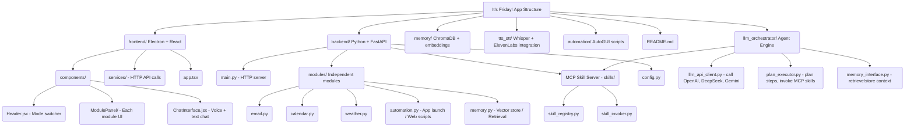
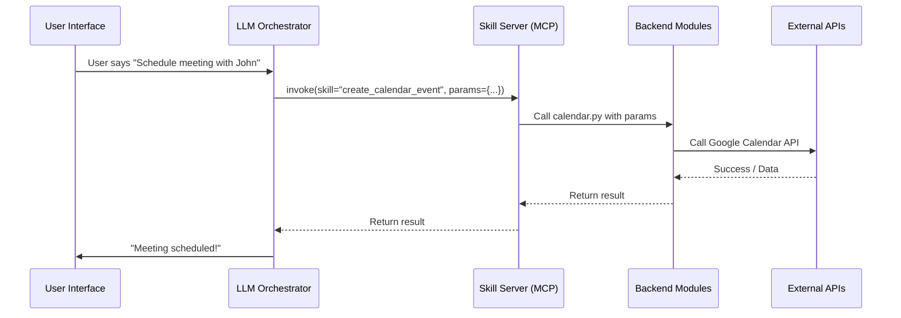

# We are making a Agent App which is called <i><b>It's Friday!😆</b></i>

## below is the Application Structure (more or less 😆)

## Here is the workflow or the app

### <b> The project is under active development</b>
