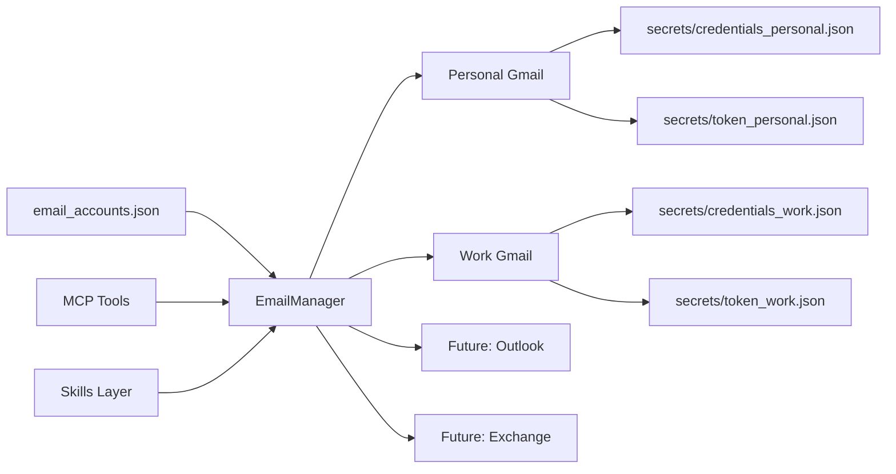
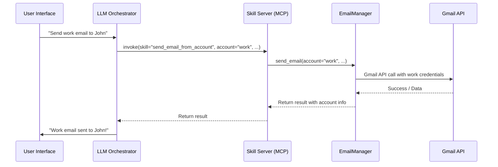

# We are making a Agent App which is called <i><b>It's Friday!😆</b></i>

## Application Structure Overview

```mermaid
flowchart TD
    A[It's Friday! App Structure] --> B(frontend/ Electron + React)
    B --> B1(components/)
    B1 --> B1a(Header.jsx - Mode switcher)
    B1 --> B1b(ModulePanel/ - Each module UI)
    B1 --> B1c(ChatInterface.jsx - Voice + text chat)
    B --> B2(services/ - HTTP API calls)
    B --> B3(app.tsx)
    
    A --> C(app/ Python + FastAPI Backend)
    C --> C1(main.py - HTTP server)
    C --> C2(modules/ Independent modules)
    C2 --> C2a(google_clients/ - Gmail, Calendar, Drive)
    C2 --> C2b(weather.py)
    C2 --> C2c(systemInfo.py)
    C --> C3(services/ Business Logic Layer)
    C3 --> C3a(weather_service.py)
    C3 --> C3b(email_manager.py - Multi-account email 🆕)
    C3 --> C3c(email_service.py - Single account deprecated ⚠️)
    C3 --> C3d(calendar_service.py)
    C3 --> C3e(drive_service.py)
    C --> C4(config.py - Multi-account configuration 🆕)
    C --> C5(secrets/ - Credentials & tokens 🆕)
    C --> C6(email_accounts.json - Account configuration 🆕)
    
    A --> S(skills/ Standalone MCP Server)
    S --> S1(server.py - FastMCP server)
    S --> S2(all_skills.py - Multi-account email skills 🆕)
    S --> S3(README.md - Skills documentation)
    
    A --> D(memory/ ChromaDB + embeddings)
    A --> E(tts_stt/ Whisper + ElevenLabs integration)
    A --> F(automation/ AutoGUI scripts)
    A --> G(README.md)
    
    A --> H(llm_orchestrator/ Agent Engine)
    H --> H1(llm_api_client.py - call OpenAI, DeepSeek, Gemini)
    H --> H2(plan_executor.py - plan steps, invoke MCP skills)
    H --> H3(memory_interface.py - retrieve/store context)
    H --> S(MCP Skill Server - skills/)
```



## Email System Architecture 🆕

The application now supports **multi-account email management**:

### New Multi-Account System:
- **EmailManager** - Manages multiple email accounts (personal, work, etc.)
- **Account-specific operations** - Send/receive from specific accounts
- **Unified interface** - Single API for all accounts
- **Secure credential storage** - Credentials stored in `app/secrets/`
- **Flexible configuration** - JSON-based account configuration

### Architecture Components:



## Application Workflow



## File Structure Changes 🆕

```
app/
├── config.py                    # Multi-account configuration
├── email_accounts.json          # Account configurations (auto-generated)
├── secrets/                     # 🆕 Secure credential storage
│   ├── credentials.json         # Default Gmail credentials
│   ├── token.json              # Default Gmail token
│   ├── credentials_personal.json # Personal account credentials
│   ├── token_personal.json     # Personal account token
│   ├── credentials_work.json   # Work account credentials
│   └── token_work.json         # Work account token
└── services/
    ├── email_manager.py        # 🆕 Multi-account email manager
    └── email_service.py        # ⚠️ Deprecated single-account service

skills/
├── all_skills.py              # 🆕 Multi-account email functions
└── server.py                  # 🆕 Multi-account MCP tools

setup_email_accounts.py       # 🆕 Account management utility
test_multi_email_setup.py     # 🆕 Setup validation script
```

## Quick Setup for Multi-Account Email

### 1. Add Email Accounts

```bash
# Add personal Gmail account
python setup_email_accounts.py add personal gmail "path/to/personal_credentials.json" "Personal Gmail"

# Add work Gmail account (set as default)
python setup_email_accounts.py add work gmail "path/to/work_credentials.json" "Work Gmail" --default

# List configured accounts
python setup_email_accounts.py list
```

### 2. Test Your Setup

```bash
python test_multi_email_setup.py
```

### 3. Use in MCP Server

```bash
cd skills && python server.py
```

## New MCP Tools Available 🆕

- `list_email_accounts()` - Show all configured accounts
- `get_unread_emails_from_account(account="personal")` - Get emails from specific account
- `get_unread_emails_all_accounts()` - Get emails from all accounts
- `send_email_from_account(..., account="work")` - Send from specific account

## Environment Configuration

### .env file (for general settings):
```bash
WEATHER_API_KEY=your_weather_api_key
SECURITY_KEY=your_security_key
LOG_LEVEL=INFO
DEFAULT_EMAIL_ACCOUNT=personal
```

### email_accounts.json (for email accounts):
```json
{
  "personal": {
    "name": "personal",
    "provider": "gmail",
    "display_name": "Personal Gmail",
    "google_credentials_path": "secrets/credentials_personal.json",
    "google_token_path": "secrets/token_personal.json",
    "enabled": true,
    "default_account": true
  },
  "work": {
    "name": "work",
    "provider": "gmail",
    "display_name": "Work Gmail", 
    "google_credentials_path": "secrets/credentials_work.json",
    "google_token_path": "secrets/token_work.json",
    "enabled": true,
    "default_account": false
  }
}
```

## Migration from Single Account

### Old Way (Deprecated):
```python
from app import email_service
result = email_service.send_email(to="user@example.com", ...)
```

### New Way (Recommended):
```python
from app import email_manager
result = await email_manager.send_email(
    to="user@example.com", 
    account="personal", 
    ...
)
```

## Security Features 🔒

- **Credential Isolation** - Each account has separate credentials
- **Secure Storage** - All credentials stored in `app/secrets/`
- **Token Management** - Automatic token refresh per account
- **Account Control** - Enable/disable accounts individually
- **Path Flexibility** - Configurable credential paths

### <b>The project is under active development</b>

**Recent Updates:**
- ✅ Multi-account email support
- ✅ Secure credential management
- ✅ MCP server integration
- ✅ Account management utilities
- ✅ Comprehensive documentation

**Coming Soon:**
- 🔄 Outlook/Exchange support
- 🔄 IMAP/SMTP support
- 🔄 Email synchronization
- 🔄 Web-based account management
- 🔄 Advanced email automation
