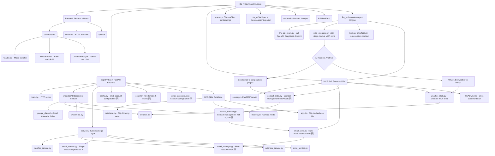
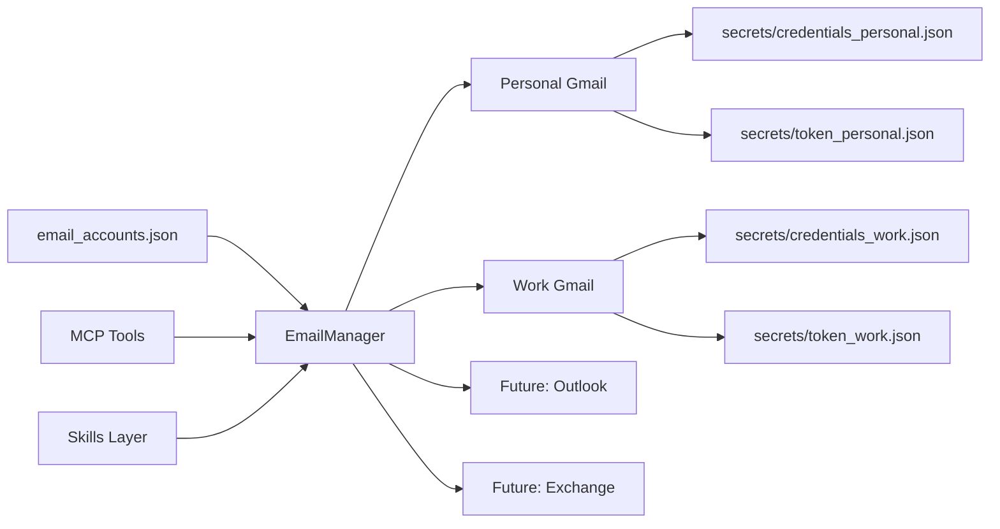
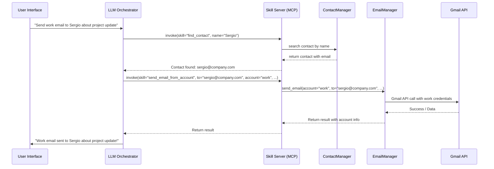

# We are making a Agent App which is called <i><b>It's Friday!😆</b></i>

## Application Structure Overview



## Email System Architecture 🆕

The application now supports **multi-account email management**:

### New Multi-Account System:
- **EmailManager** - Manages multiple email accounts (personal, work, etc.)
- **Account-specific operations** - Send/receive from specific accounts
- **Unified interface** - Single API for all accounts
- **Secure credential storage** - Credentials stored in `app/secrets/`
- **Flexible configuration** - JSON-based account configuration

### Architecture Components:



## Application Workflow



## Codebase Structure 📁

```
its-Friday/
├── 📄 ReadMe.md                     # Project documentation
├── 📄 requirements.txt              # Python dependencies
├── 📄 api.json                      # API configuration
├── 📄 .env.sample                   # Environment template
├── 📄 MULTI_ACCOUNT_FIX_SUMMARY.md  # Multi-account fix documentation
│
├── 📁 app/                          # Main Python application
│   ├── 📄 __init__.py               # App initialization & service instances
│   ├── 📄 main.py                   # FastAPI HTTP server
│   ├── 📄 config.py                 # Multi-account configuration system
│   ├── 📄 dependencies.py           # FastAPI dependencies & auth
│   ├── 📄 utils.py                  # Utility functions & EmailAccountManager
│   ├── 📄 .env                      # Environment variables (local)
│   ├── 📄 email_accounts.json       # Email account configurations
│   ├── 📄 email_accounts.json.example # Email config template
│   │
│   ├── 📁 db/                       # Database layer
│   │   ├── 📄 database.py           # SQLAlchemy database setup
│   │   ├── 📄 models.py             # Database models (Contact, etc.)
│   │   └── 📄 app.db                # SQLite database file
│   │
│   ├── 📁 modules/                  # Core functionality modules
│   │   ├── 📄 __init__.py           # Module imports
│   │   ├── 📄 weather.py            # Weather API client
│   │   ├── 📄 contact_booklet.py    # Contact management
│   │   ├── 📄 systemInfo.py         # System information gathering
│   │   │
│   │   ├── 📁 google_clients/       # Google API clients
│   │   │   ├── 📄 __init__.py       # Google clients exports
│   │   │   ├── 📄 google_base_client.py # OAuth2 base client
│   │   │   ├── 📄 gmail_client.py   # Gmail API wrapper
│   │   │   ├── 📄 calendar_client.py# Calendar API wrapper
│   │   │   └── 📄 drive_client.py   # Drive API wrapper
│   │   │
│   │   └── 📁 email_clients/        # Email provider adapters
│   │       ├── 📄 __init__.py       # Email clients exports
│   │       ├── 📄 base_email_client.py # Abstract email interface
│   │       ├── 📄 gmail_client_adapter.py # Gmail adapter
│   │       ├── 📄 outlook_client_adapter.py # Outlook adapter (placeholder)
│   │       └── 📄 README.md         # Email architecture docs
│   │
│   ├── 📁 services/                 # Business logic layer
│   │   ├── 📄 __init__.py           # Service exports
│   │   ├── 📄 weather_service.py    # Weather operations
│   │   ├── 📄 email_manager.py      # 🆕 Multi-account email manager
│   │   ├── 📄 calendar_service.py   # Calendar operations
│   │   └── 📄 drive_service.py      # Drive operations
│   │
│   ├── 📁 routes/                   # FastAPI route handlers
│   │   ├── 📄 __init__.py           # Routes initialization
│   │   └── 📄 weather_endpoints.py  # Weather HTTP endpoints
│   │
│   ├── 📁 secrets/                  # 🔒 Secure credential storage
│   │   ├── 📄 credentials.json      # Default Gmail credentials
│   │   ├── 📄 token.json           # Default Gmail token
│   │   └── 📄 test_token.json      # Test credentials
│   │
│   └── 📁 logs/                     # Application logs
│
├── 📁 skills/                       # 🤖 MCP Server (Model Context Protocol)
│   ├── 📄 __init__.py               # Skills module exports
│   ├── 📄 server.py                 # FastMCP server with all tools
│   ├── 📄 weather_skills.py         # Weather-related MCP tools
│   ├── 📄 email_skills.py           # 🆕 Multi-account email tools
│   ├── 📄 calendar_skills.py        # Calendar-related MCP tools
│   ├── 📄 drive_skills.py           # Drive-related MCP tools
│   └── 📄 README.md                 # Skills documentation
│
├── 📁 examples/                     # Usage examples
│   └── 📄 email_manager_demo.py     # EmailManager usage examples
│
├── 📁 testing/                      # Test suite
│   ├── 📄 test_auth_system.py       # Google OAuth testing
│   ├── 📄 test_contact.py           # Contact system testing
│   ├── 📄 test_email.py             # Email functionality testing
│   └── 📁 need_verify/              # Integration test results
│       └── 📄 README.MD             # Test verification docs
│
└── 📁 ZZZ_guides/                   # 📚 Comprehensive documentation
    ├── 📄 EMAIL_SYSTEM_ARCHITECTURE.md # Email system detailed docs
    ├── 📄 GMAIL_CLIENT_README.md     # Gmail client documentation
    ├── 📄 INTEGRATION_GUIDE.md       # Integration guide
    ├── 📄 MULTI_ACCOUNT_EMAIL_GUIDE.md # Multi-account setup guide
    ├── 📄 OAUTH_FLOW.md             # OAuth2 authentication flow
    └── 📄 gmail_client_examples.py  # Gmail client code examples
```

## Quick Setup for Multi-Account Email

### 1. Add Email Accounts

```bash
# Add personal Gmail account
python setup_email_accounts.py add personal gmail "path/to/personal_credentials.json" "Personal Gmail"

# Add work Gmail account (set as default)
python setup_email_accounts.py add work gmail "path/to/work_credentials.json" "Work Gmail" --default

# List configured accounts
python setup_email_accounts.py list
```

### 2. Test Your Setup

```bash
python test_multi_email_setup.py
```

### 3. Use in MCP Server

```bash
cd skills && python server.py
```

## New MCP Tools Available 🆕

### Contact Management Tools:
- `list_contacts(offset=0, limit=20)` - List all contacts with pagination
- `find_contact(name="Sergio")` - Search contacts by name (surname/forename)
- `add_contact(contact_data)` - Add new contact to database
- `update_contact(contact_id, updated_data)` - Update existing contact
- `delete_contact(name)` - Delete contacts by name
- `get_contact_by_id(contact_id)` - Get specific contact by ID

### Email Management Tools:
- `list_email_accounts()` - Show all configured accounts
- `get_unread_emails_from_account(account="personal")` - Get emails from specific account
- `get_unread_emails_all_accounts()` - Get emails from all accounts
- `send_email_from_account(..., account="work")` - Send from specific account
- `create_draft_tool(..., account="work")` - Create email drafts
- `mark_emails_as_read_tool(message_ids, account)` - Mark emails as read

### Smart Automation Examples:
```
User: "Send an email to Sergio about the Friday project update"
→ Model finds Sergio's contact → Gets email address → Sends email

User: "Email all clients about the new feature"  
→ Model searches contacts with tag 'client' → Sends bulk emails

User: "What's John's phone number?"
→ Model searches contacts for John → Returns contact details
```

## Environment Configuration

### .env file (for general settings):
```bash
WEATHER_API_KEY=your_weather_api_key
SECURITY_KEY=your_security_key
LOG_LEVEL=INFO
DEFAULT_EMAIL_ACCOUNT=personal
```

### email_accounts.json (for email accounts):
```json
{
  "personal": {
    "name": "personal",
    "provider": "gmail",
    "display_name": "Personal Gmail",
    "google_credentials_path": "secrets/credentials_personal.json",
    "google_token_path": "secrets/token_personal.json",
    "enabled": true,
    "default_account": true
  },
  "work": {
    "name": "work",
    "provider": "gmail",
    "display_name": "Work Gmail", 
    "google_credentials_path": "secrets/credentials_work.json",
    "google_token_path": "secrets/token_work.json",
    "enabled": true,
    "default_account": false
  }
}
```

## Migration from Single Account

### Old Way (Deprecated):
```python
from app import email_service
result = email_service.send_email(to="user@example.com", ...)
```

### New Way (Recommended):
```python
from app import email_manager
result = await email_manager.send_email(
    to="user@example.com", 
    account="personal", 
    ...
)
```

## Security Features 🔒

- **Credential Isolation** - Each account has separate credentials
- **Secure Storage** - All credentials stored in `app/secrets/`
- **Token Management** - Automatic token refresh per account
- **Account Control** - Enable/disable accounts individually
- **Path Flexibility** - Configurable credential paths

### <b>The project is under active development</b>

**Recent Updates:**
- ✅ Multi-account email support
- ✅ Contact management system with SQLite database
- ✅ Secure credential management
- ✅ MCP server integration with contact tools
- ✅ Account management utilities
- ✅ Smart email automation (contact lookup + email sending)
- ✅ Comprehensive documentation

**Coming Soon:**
- 🔄 Outlook/Exchange support
- 🔄 IMAP/SMTP support
- 🔄 Email synchronization
- 🔄 Web-based account management
- 🔄 Advanced email automation
